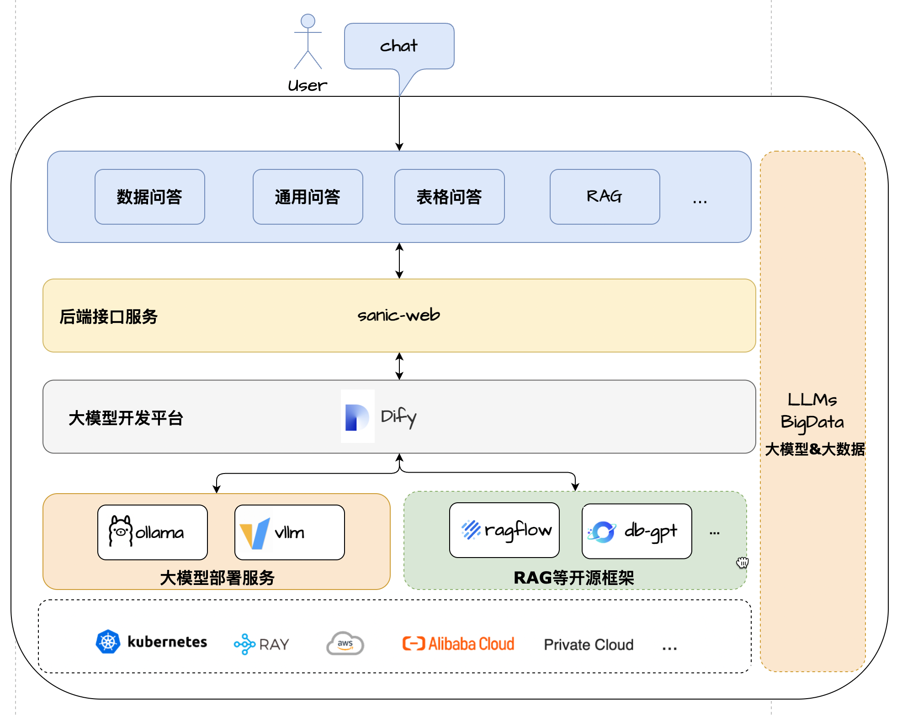

# 大模型数据助手

🌟 **项目简介**

一个轻量级、支持全链路且易于二次开发的大模型应用项目 

**已集成MCP多智能体架构**

基于 Dify 、LangChain/LangGraph、Ollama&Vllm、Sanic 和 Text2SQL 📊 等技术构建的一站式大模型应用开发项目，采用 Vue3、TypeScript 和 Vite 5 打造现代UI。它支持通过 
ECharts 📈 
实现基于大模型的数据图形化问答，具备处理 CSV 文件 📂 表格问答的能力。同时，能方便对接第三方开源 RAG 系统 检索系统 🌐等，以支持广泛的通用知识问答。

作为轻量级的大模型应用开发项目，Sanic-Web 🛠️ 支持快速迭代与扩展，助力大模型项目快速落地。🚀

## 架构方案

## 🎉 **特性**
- **核心技术栈**：Dify + Ollama + RAG + (Qwen3/DeepSeek) + Text2SQL + MCP
- **UI 框架**：Vue 3 + TypeScript + Vite 5
- **数据问答**：集成 ECharts大模型实现Text2SQL轻量级的图形化数据问答展示
- **表格问答**：支持 CSV格式文件的上传与基于大模型总结预处理和Text2SQL的表格数据问答
- **通用问答**：支持通用数据形式问答基于对接三方RAG系统+公网检索模式
- **应用架构**：作为一个轻量级全链路一站式大模型应用开发框架方便扩展落地
- **灵活部署**：支持大模型应用开发各依赖组件docker-compose一键拉起快速部署零配置

## 运行效果
<table>
<tbody>
<tr>
<td>

<video src="https://github.com/user-attachments/assets/0186b574-8267-4e99-8b9d-77eaee4fd02e" controls="controls" muted="muted" class="d-block rounded-bottom-2 border-top width-fit" style="max-height:640px; min-height: 200px">
</video>

<td>

<video src="https://private-user-images.githubusercontent.com/49786633/469171050-15dcf089-5659-489e-849d-39c651ca7e5a.mp4?jwt=eyJhbGciOiJIUzI1NiIsInR5cCI6IkpXVCJ9.eyJpc3MiOiJnaXRodWIuY29tIiwiYXVkIjoicmF3LmdpdGh1YnVzZXJjb250ZW50LmNvbSIsImtleSI6ImtleTUiLCJleHAiOjE3NTMxOTEzNzEsIm5iZiI6MTc1MzE5MTA3MSwicGF0aCI6Ii80OTc4NjYzMy80NjkxNzEwNTAtMTVkY2YwODktNTY1OS00ODllLTg0OWQtMzljNjUxY2E3ZTVhLm1wND9YLUFtei1BbGdvcml0aG09QVdTNC1ITUFDLVNIQTI1NiZYLUFtei1DcmVkZW50aWFsPUFLSUFWQ09EWUxTQTUzUFFLNFpBJTJGMjAyNTA3MjIlMkZ1cy1lYXN0LTElMkZzMyUyRmF3czRfcmVxdWVzdCZYLUFtei1EYXRlPTIwMjUwNzIyVDEzMzExMVomWC1BbXotRXhwaXJlcz0zMDAmWC1BbXotU2lnbmF0dXJlPTY5ZGU2MWU3NzA5NjYxM2ZhZDYxYTZjMWQxYWMzNGM2MTY2ODkzMTIzYjQ1NzRiOGZkOWUyODYzNmQ4N2Y5ZTUmWC1BbXotU2lnbmVkSGVhZGVycz1ob3N0In0.7KW-JGmFACnf5IS3kL7M0eV8uZhlxDD8Br61XvcgmjY" data-canonical-src="https://private-user-images.githubusercontent.com/49786633/469171050-15dcf089-5659-489e-849d-39c651ca7e5a.mp4?jwt=eyJhbGciOiJIUzI1NiIsInR5cCI6IkpXVCJ9.eyJpc3MiOiJnaXRodWIuY29tIiwiYXVkIjoicmF3LmdpdGh1YnVzZXJjb250ZW50LmNvbSIsImtleSI6ImtleTUiLCJleHAiOjE3NTMxOTEzNzEsIm5iZiI6MTc1MzE5MTA3MSwicGF0aCI6Ii80OTc4NjYzMy80NjkxNzEwNTAtMTVkY2YwODktNTY1OS00ODllLTg0OWQtMzljNjUxY2E3ZTVhLm1wND9YLUFtei1BbGdvcml0aG09QVdTNC1ITUFDLVNIQTI1NiZYLUFtei1DcmVkZW50aWFsPUFLSUFWQ09EWUxTQTUzUFFLNFpBJTJGMjAyNTA3MjIlMkZ1cy1lYXN0LTElMkZzMyUyRmF3czRfcmVxdWVzdCZYLUFtei1EYXRlPTIwMjUwNzIyVDEzMzExMVomWC1BbXotRXhwaXJlcz0zMDAmWC1BbXotU2lnbmF0dXJlPTY5ZGU2MWU3NzA5NjYxM2ZhZDYxYTZjMWQxYWMzNGM2MTY2ODkzMTIzYjQ1NzRiOGZkOWUyODYzNmQ4N2Y5ZTUmWC1BbXotU2lnbmVkSGVhZGVycz1ob3N0In0.7KW-JGmFACnf5IS3kL7M0eV8uZhlxDD8Br61XvcgmjY" controls="controls" muted="muted" class="d-block rounded-bottom-2 border-top width-fit" style="max-height:640px; min-height: 200px">
</video>

</td>
</tr>
<tr>
<td>
<video src="https://private-user-images.githubusercontent.com/49786633/469171112-cd99e2f8-9887-459f-ae51-00e7883fa050.mp4?jwt=eyJhbGciOiJIUzI1NiIsInR5cCI6IkpXVCJ9.eyJpc3MiOiJnaXRodWIuY29tIiwiYXVkIjoicmF3LmdpdGh1YnVzZXJjb250ZW50LmNvbSIsImtleSI6ImtleTUiLCJleHAiOjE3NTMxOTEzNzEsIm5iZiI6MTc1MzE5MTA3MSwicGF0aCI6Ii80OTc4NjYzMy80NjkxNzExMTItY2Q5OWUyZjgtOTg4Ny00NTlmLWFlNTEtMDBlNzg4M2ZhMDUwLm1wND9YLUFtei1BbGdvcml0aG09QVdTNC1ITUFDLVNIQTI1NiZYLUFtei1DcmVkZW50aWFsPUFLSUFWQ09EWUxTQTUzUFFLNFpBJTJGMjAyNTA3MjIlMkZ1cy1lYXN0LTElMkZzMyUyRmF3czRfcmVxdWVzdCZYLUFtei1EYXRlPTIwMjUwNzIyVDEzMzExMVomWC1BbXotRXhwaXJlcz0zMDAmWC1BbXotU2lnbmF0dXJlPWYyYmU5ODg4ZjI5NDNjZjBiYTVjYWRjMTI2ZGEyMDdjOWU2OTk2M2EwZjU4N2ZkYzU5NTQ5ZDJjMmUxMWNjNjAmWC1BbXotU2lnbmVkSGVhZGVycz1ob3N0In0.OSPODm-E7K7PJaao8uThG1toIKsX3h93UEXS5GDqruQ" data-canonical-src="https://private-user-images.githubusercontent.com/49786633/469171112-cd99e2f8-9887-459f-ae51-00e7883fa050.mp4?jwt=eyJhbGciOiJIUzI1NiIsInR5cCI6IkpXVCJ9.eyJpc3MiOiJnaXRodWIuY29tIiwiYXVkIjoicmF3LmdpdGh1YnVzZXJjb250ZW50LmNvbSIsImtleSI6ImtleTUiLCJleHAiOjE3NTMxOTEzNzEsIm5iZiI6MTc1MzE5MTA3MSwicGF0aCI6Ii80OTc4NjYzMy80NjkxNzExMTItY2Q5OWUyZjgtOTg4Ny00NTlmLWFlNTEtMDBlNzg4M2ZhMDUwLm1wND9YLUFtei1BbGdvcml0aG09QVdTNC1ITUFDLVNIQTI1NiZYLUFtei1DcmVkZW50aWFsPUFLSUFWQ09EWUxTQTUzUFFLNFpBJTJGMjAyNTA3MjIlMkZ1cy1lYXN0LTElMkZzMyUyRmF3czRfcmVxdWVzdCZYLUFtei1EYXRlPTIwMjUwNzIyVDEzMzExMVomWC1BbXotRXhwaXJlcz0zMDAmWC1BbXotU2lnbmF0dXJlPWYyYmU5ODg4ZjI5NDNjZjBiYTVjYWRjMTI2ZGEyMDdjOWU2OTk2M2EwZjU4N2ZkYzU5NTQ5ZDJjMmUxMWNjNjAmWC1BbXotU2lnbmVkSGVhZGVycz1ob3N0In0.OSPODm-E7K7PJaao8uThG1toIKsX3h93UEXS5GDqruQ" controls="controls" muted="muted" class="d-block rounded-bottom-2 border-top width-fit" style="max-height:640px; min-height: 200px">
</video>
</td>
<td>

<video src="https://private-user-images.githubusercontent.com/49786633/469171151-657bbe61-5516-4ab9-84c2-c6ca75cc4a6f.mp4?jwt=eyJhbGciOiJIUzI1NiIsInR5cCI6IkpXVCJ9.eyJpc3MiOiJnaXRodWIuY29tIiwiYXVkIjoicmF3LmdpdGh1YnVzZXJjb250ZW50LmNvbSIsImtleSI6ImtleTUiLCJleHAiOjE3NTMxOTEzNzEsIm5iZiI6MTc1MzE5MTA3MSwicGF0aCI6Ii80OTc4NjYzMy80NjkxNzExNTEtNjU3YmJlNjEtNTUxNi00YWI5LTg0YzItYzZjYTc1Y2M0YTZmLm1wND9YLUFtei1BbGdvcml0aG09QVdTNC1ITUFDLVNIQTI1NiZYLUFtei1DcmVkZW50aWFsPUFLSUFWQ09EWUxTQTUzUFFLNFpBJTJGMjAyNTA3MjIlMkZ1cy1lYXN0LTElMkZzMyUyRmF3czRfcmVxdWVzdCZYLUFtei1EYXRlPTIwMjUwNzIyVDEzMzExMVomWC1BbXotRXhwaXJlcz0zMDAmWC1BbXotU2lnbmF0dXJlPTVmNGExZTlhNmM5NWMzMjc3ZWFlNTcyMzZjZTA4NWU4ZjY3OTA5ZTg5NzgwNDA2ODExNTg5MTkyNGQ5NDYzNTgmWC1BbXotU2lnbmVkSGVhZGVycz1ob3N0In0.n3ZWlSK1GSM5Zyibk-D9jAArzDqvX3WdZtj7IdzG-4I" data-canonical-src="https://private-user-images.githubusercontent.com/49786633/469171151-657bbe61-5516-4ab9-84c2-c6ca75cc4a6f.mp4?jwt=eyJhbGciOiJIUzI1NiIsInR5cCI6IkpXVCJ9.eyJpc3MiOiJnaXRodWIuY29tIiwiYXVkIjoicmF3LmdpdGh1YnVzZXJjb250ZW50LmNvbSIsImtleSI6ImtleTUiLCJleHAiOjE3NTMxOTEzNzEsIm5iZiI6MTc1MzE5MTA3MSwicGF0aCI6Ii80OTc4NjYzMy80NjkxNzExNTEtNjU3YmJlNjEtNTUxNi00YWI5LTg0YzItYzZjYTc1Y2M0YTZmLm1wND9YLUFtei1BbGdvcml0aG09QVdTNC1ITUFDLVNIQTI1NiZYLUFtei1DcmVkZW50aWFsPUFLSUFWQ09EWUxTQTUzUFFLNFpBJTJGMjAyNTA3MjIlMkZ1cy1lYXN0LTElMkZzMyUyRmF3czRfcmVxdWVzdCZYLUFtei1EYXRlPTIwMjUwNzIyVDEzMzExMVomWC1BbXotRXhwaXJlcz0zMDAmWC1BbXotU2lnbmF0dXJlPTVmNGExZTlhNmM5NWMzMjc3ZWFlNTcyMzZjZTA4NWU4ZjY3OTA5ZTg5NzgwNDA2ODExNTg5MTkyNGQ5NDYzNTgmWC1BbXotU2lnbmVkSGVhZGVycz1ob3N0In0.n3ZWlSK1GSM5Zyibk-D9jAArzDqvX3WdZtj7IdzG-4I" controls="controls" muted="muted" class="d-block rounded-bottom-2 border-top width-fit" style="max-height:640px; min-height: 200px">
</video>
  
</td>
</tr>
</tbody>
</table>

## 🌹 支持

如果你喜欢这个项目或发现有用，可以点右上角 [`Star`](https://github.com/apconw/sanic-web) 支持一下，你的支持是我们不断改进的动力，感谢！ ^_^

## ⭐ Star History
 

## 💼 商务合作
- **我们能承接 写作类、报告类、数据问答、表格问答、数字人大屏等具体垂直业务场景的项目需求，欢迎联系微信(备注 商务合作)**
- **联系方式：在最下方关注公众号后获取**

## 🐳 关于技术支持申明
- 开源不易，本人精力和时间有限，如需一对一技术支持，请先赞助。联系微信(备注 技术支持)
- 一对一技术支持 我将亲自远程帮您配置开发环境部署和启动、并讲解项目架构以及二开思路等
- 长期技术支持方式 拉你加入群(一线算法、架构大佬群，为你提供技术指导，项目解决方案等

| 技术支持方式                         |     赞助     | 
|:-------------------------------|:----------:|
| 一对一技术支持 我将亲自远程帮您配置开发环境部署和启动    | **100元/次** |
| 长期技术支持（**不限次数**，提供技术指导，项目解决方等） |  **365元**  |   

## QA交流群
- 大模型应用交流群欢迎大家, 欢迎加进群讨论分享经验
- 关注下面的公众号点击·**微信群**菜单添加微信拉你入群

|                   微信群                   |
|:---------------------------------------:|
|  | 

## License

[MIT](./LICENSE) License | Copyright © 2024-PRESENT [AiAdventurer](https://github.com/apconw)
