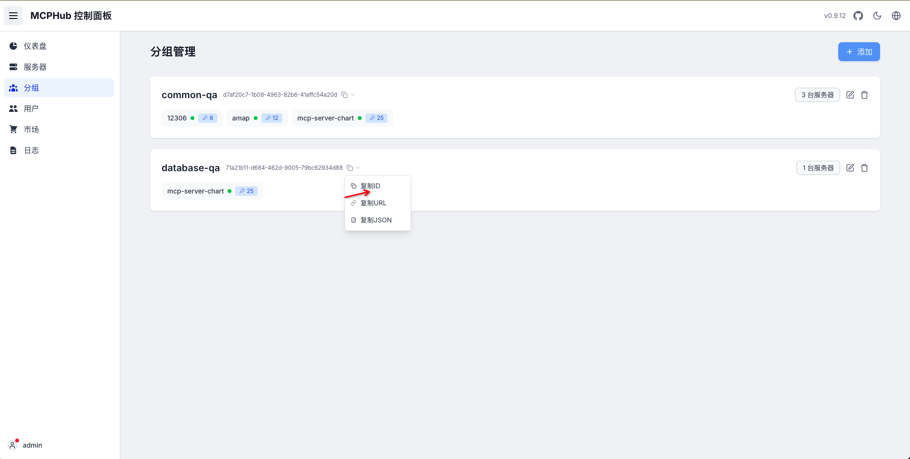
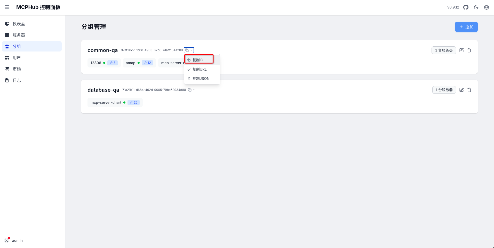

## 💡环境配置要求

在开始之前，请确保您的开发环境满足以下最低配置要求：

- **操作系统**：Windows 10/11, macOs M系列, Centos/Ubuntu
- **GPU**: 本地使用ollama部署，推荐使用Nvidia显卡或CPU模式。**推荐公网购买APIKEY形式**
- **内存**：8GB+

### 🔧 **前置条件**
* Python 3.11.x
* uv 0.8.0+
* Dify 0.7.1+
* Mysql 8.0+
* Node.js 18.12.x+
* Pnpm 9.x
* Mcp-Hub 0.9.0+
* Gpt-vis-api 0.0.1+

### 📚 **大模型选择**
- 推荐购买公网大模型[阿里云公网大模型服务APIKEY](http://aliyun.com/product/bailian)
- 模型要求: **目前只支持Qwen系列模型**


### **1. Clone仓库**
```angular2html
git clone https://github.com/apconw/sanic-web.git
```

### **2. 执行部署脚本**
```angular2html
cd docker
./deploy.sh
```

### **3. 中间件配置**
#### 🌲 Mino
> 下面chat-service/gpt-vis-api服务都依赖Minio服务

##### 配置
 - 访问MinIO服务，http://localhost:19001/ 账号:admin 密码:12345678
 - 创建两个个bucket，名称**filedata和chart-images** **同时配置Access Key保存好下面会使用**
 - 修改bucket的**chart-images**访问策略为**public**

 
 

#### 🌵 mcp-hub
- [官方文档](https://github.com/samanhappy/mcphub)
> mcp-hub是一个开源的MCP聚合工具方便安装和管理MCP工具


##### 配置
- 登录http://localhost:3300/ admin/admin123
- **国内镜像配置**
    - Python 包仓库地址: https://mirrors.aliyun.com/pypi/simple
    - NPM 仓库地址: https://registry.npmmirror.com


##### 工具
> 需要安装两个工具mcp-server-chart蚂蚁图表工具/12306火车票查询工具

- **mcp-server-chart**
    - **VIS_REQUEST_SERVER**环境变量配置默认为**gpt-vis-api**服务地址本
    - 本地启动不需要修改如果是服务器部署**host.docker.internal**需要修改为实际IP地址
    - 安装完成后创建一个工具组并复制访问地址先保存一下
    - 后面配置**MCP_HUB_DATABASE_QA_GROUP_URL**变量时从这里取值
```angular2html
npx -y -y @antv/mcp-server-chart

VIS_REQUEST_SERVER: http://host.docker.internal:3100/generate
```
- 安装工具


- 创建组


- 获取访问链接



- **12306火车票查询工具**
    - 安装完成后创建一个工具组并复制访问地址先保存一下
    - 后面配置**MCP_HUB_COMMON_QA_GROUP_URL**变量时从这里取值
```angular2html
npx -y 12306-mcp
```
- 安装工具


- 创建组


- 获取访问链接


### 🌿 Noe4j
> Noe4j是一个开源的图数据库，用于存储和查询关系数据。
> Noe4j的安装和配置请参考[官方文档](https://neo4j.com/docs/operations-manual/current/installation/)
#### 启动
```angular2html
cd docker
docker compose up -d neo4j-apoc
```
#### 配置
- 登录http://localhost:7474/browser/ neo4j/neo4j123


### 🌿 mineru
#### 启动 vllm-server 服务
并通过`vlm-http-client`后端连接`vllm-server`
  ```bash
  docker compose -f compose.yaml --profile vllm-server up -d
  ```
  >[!TIP]
  >在另一个终端中通过http client连接vllm server（只需cpu与网络，不需要vllm环境）
  > ```bash
  > mineru -p <input_path> -o <output_path> -b vlm-http-client -u http://<server_ip>:30000
  > ```

---

#### 启动 Web API 服务
  ```bash
  docker compose -f compose.yaml --profile api up -d
  ```
  >[!TIP]
  >在浏览器中访问 `http://<server_ip>:8000/docs` 查看API文档。

---

#### 启动 Gradio WebUI 服务
  ```bash
  docker compose -f compose.yaml --profile gradio up -d
  ```
  >[!TIP]
  > 
  >- 在浏览器中访问 `http://<server_ip>:7860` 使用 Gradio WebUI。
  >- 访问 `http://<server_ip>:7860/?view=api` 使用 Gradio API。
